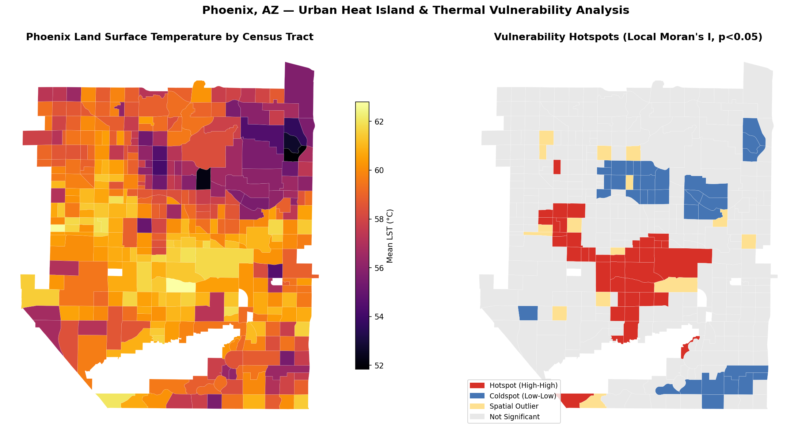

# Phoenix Urban Heat Island & Thermal Vulnerability Mapper

**A geospatial pipeline quantifying heat exposure and demographic vulnerability across Phoenix, AZ, built on real Landsat 8/9 thermal imagery and US Census data.**

---

## Problem

Urban heat is not distributed equally. In Phoenix — one of the hottest major metros in the US — surface temperatures can vary by 10°C+ between neighborhoods just a few miles apart, driven by tree canopy, impervious surface coverage, and land use. The neighborhoods that run hottest are frequently also the ones with the least capacity to cope: older housing stock, less tree canopy investment, higher elderly and low-income populations.

This project builds an end-to-end pipeline to measure that pattern directly from satellite data and identify where heat and vulnerability overlap — the kind of analysis increasingly used in climate adaptation planning, InsurTech risk modeling, and municipal resilience programs.

## What it does

1. **Retrieves real Landsat 8/9 thermal imagery** for Phoenix via Microsoft's Planetary Computer STAC catalog and derives Land Surface Temperature (LST) using a physics-based radiative transfer chain (DN → TOA radiance → brightness temperature → NDVI-derived emissivity → LST).
2. **Computes zonal statistics** — mean LST, tree canopy %, and impervious surface % (from ESA WorldCover) per census tract.
3. **Builds a composite vulnerability index** combining thermal exposure with elderly population % and low-income % (US Census ACS 5-year estimates).
4. **Runs Local Moran's I spatial autocorrelation** to identify statistically significant heat-vulnerability hotspot clusters, not just high raw values — this distinguishes genuine spatial patterns from noise.
5. **Exposes results via a FastAPI REST endpoint** for programmatic querying by bounding box or point — moving beyond a static notebook into something deployable.

## Results

Analysis of 360 Maricopa County census tracts (real Landsat scene, summer 2024, <10% cloud cover):

| Cluster type | Tract count | Interpretation |
|---|---|---|
| Hotspot (High-High) | 38 | Statistically significant heat + vulnerability clustering |
| Coldspot (Low-Low) | 34 | Low heat, low vulnerability clustering |
| Spatial Outlier | 16 | Anomalous relative to neighbors |
| Not Significant | 272 | No meaningful spatial clustering |

**Validation:** The identified hotspot cluster is concentrated in South/Central Phoenix — a pattern independently corroborated by published environmental justice and urban heat research in the region. This is a meaningful signal: the pipeline reproduced a known real-world spatial pattern from raw satellite input, without that pattern being hardcoded or assumed.

## Tech stack

`Python` · `rasterio` · `GeoPandas` · `libpysal` / `esda` (Moran's I) · `rasterstats` · `FastAPI` · Landsat 8/9 (Microsoft Planetary Computer STAC) · ESA WorldCover · US Census TIGER/Line + ACS

## Limitations (documented deliberately — not hidden)

- **Single-scene LST** reflects one moment in time; cloud contamination, time-of-day, and seasonal variation all shift results. Production use should composite multiple cloud-free scenes.
- **Vulnerability index weights are equal (1/3 each)** by design choice, not a validated model — a starting point meant to be calibrated against heat-mortality or health outcome data.
- **A handful of large peripheral tracts** (sparse desert/rural) can visually dominate choropleth maps despite low population relevance — worth excluding or area-normalizing in a refined version.
- **No ground-truth station validation yet** — the logical next step before calling this production-grade.

## Why this approach

Documenting limitations honestly, rather than presenting a polished black box, reflects how climate risk analytics is actually built and reviewed in industry — scientific defensibility matters more than a clean demo.

---
*Data: Landsat 8/9 (USGS/NASA, via Microsoft Planetary Computer), ESA WorldCover, US Census Bureau ACS 5-Year Estimates & TIGER/Line Shapefiles.*
